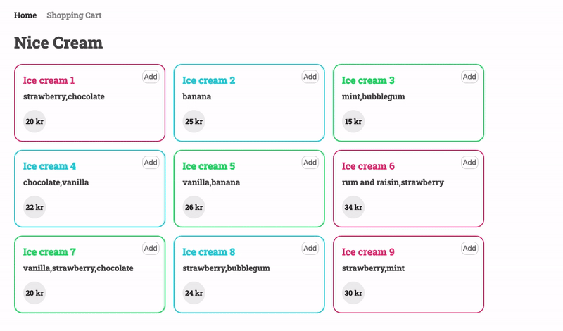

# JavaScript 2 Resit 1

## Brief

There is an example solution as a gif at the end of this README. The CSS and HTML from the example below has been provided, though you may style the assignment any way you wish.

Use modules (imports/exports) where you think they are appropriate.

### Home page

-   Loop through the array of ice creams in `js/data/ice-creams.js` and create HTML for each that displays the name, flavours and price.
-   Each item should have a button or icon that adds or removes the ice cream from an array in local storage.
-   The button or icon should indicate whether the ice cream is in local storage or not.

### Cart page

-   Retrieve the array from local storage and create HTML for each that displays the name and price.
-   Each item should have a button or icon that removes the ice cream from the local storage array and rebuilds the HTML. Ask the user for confirmation before removing the ice cream.
-   Display the total number of items in the array.
-   Display the sum of all the prices in the array.
-   Include a button that clears the array and removes all items in the HTML. Ask the user for confirmation before peforming this action.

## Marking rubric

-   Home page: Creating HTML for each ice cream in the `js/data/ice-creams.js` array - 1
-   Home page: Add and removing from cart array in local storage and changing the button/icon style accordingly - 2.5
-   Cart page: Creating HTML for each ice cream in the local storage array and displaying the item total - 1
-   Cart page: Removing item from local storage array and rebuilding the HTML - 3
-   Cart page: Clear button functionality (clearing the array and rebuilding the HTML) - 1
-   Cart page: Price total - 1
-   Code is properly formatted and arranged and variables and functions are appropriately named - 0.5

## Submission

-  Submit the link to your repo on Moodle

## Example

